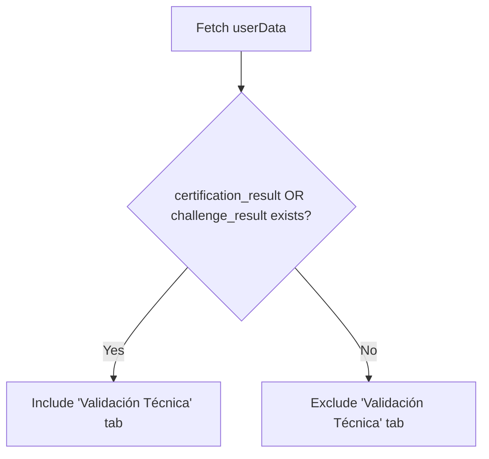

# Data Model: Conditional Admin Technical Tab Visibility

**Feature**: 001-admin-tech-tab-visibility

## Overview
This feature does not introduce new entities or database schema changes. It purely consumes existing data from the `Candidate (User)` entity to determine UI visibility.

## Consumed Data Patterns
The visibility logic depends on the following existing fields in the `User` object (fetched from the database and parsed into `userData`):

- **certification_result**: Present when the candidate has completed a certification.
- **challenge_result**: Present when a challenge has been assigned/completed.

## Logic Flow

