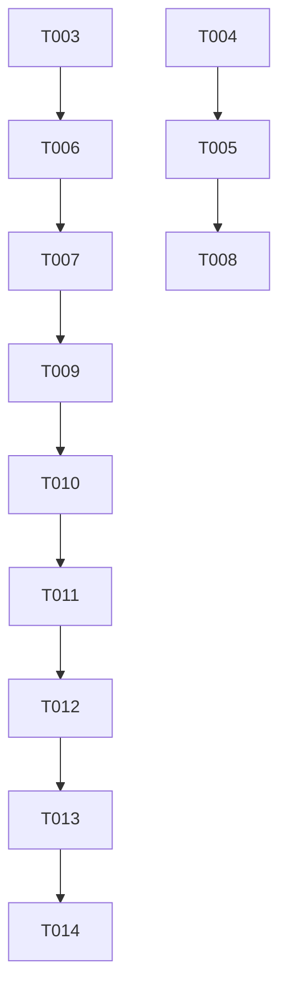

# Tasks: Secure Certification Question Validation

**Feature**: Secure Certification Question Validation
**Implementation Strategy**: MVP First (User Story 1), then feedback details (User Story 2).

## Phase 1: Setup

- [x] T001 Initialize feature documentation in specs/015-secure-cert-questions/
- [x] T002 Update GEMINI.md with new technology context

## Phase 2: Foundational

- [x] T003 [P] Create validation utility placeholder in lib/ia/certification.ts
- [x] T004 Define SanitizedQuestion and CertificationResult types in types/outputConfig.ts

## Phase 3: User Story 1 - Secure Knowledge Certification (Priority: P1)
**Goal**: Prevent correct answers from being sent to the client and move validation to the server.

- [x] T005 [P] [US1] Update GET /api/certification in app/api/certification/route.ts to strip correctAnswer and rationale
- [x] T006 [US1] Implement server-side scoring logic in lib/ia/certification.ts
- [x] T007 [US1] Update POST /api/certification in app/api/certification/route.ts to use server-side validation
- [x] T008 [US1] Remove local validation logic from DynamicMCQForm in components/DynamicMCQForm.tsx
- [x] T009 [US1] Update DynamicMCQForm submission handler to expect result from API in components/DynamicMCQForm.tsx

## Phase 4: User Story 2 - Transparent but Secure Results (Priority: P2)
**Goal**: Display score and explanations fetched from the server after submission.

- [x] T010 [P] [US2] Update POST /api/certification response to include rationale and correct answers for mistakes in app/api/certification/route.ts
- [x] T011 [US2] Update DynamicMCQForm to render explanations from the API response in components/DynamicMCQForm.tsx

## Phase 5: Polish & Cross-cutting Concerns

- [x] T012 Implement time-limit validation on the backend in app/api/certification/route.ts
- [x] T013 Create security verification script in scripts/verify-cert-security.sh
- [x] T014 Run final end-to-end manual verification

## Dependencies

## Parallel Execution Examples

- **Setup & Foundational**: T003 and T004 can start in parallel.
- **US1 & US2 Prep**: T005 (GET) and T006 (Utility logic) can start in parallel.
- **Verification**: T013 can be developed while T012 is being finalized.
