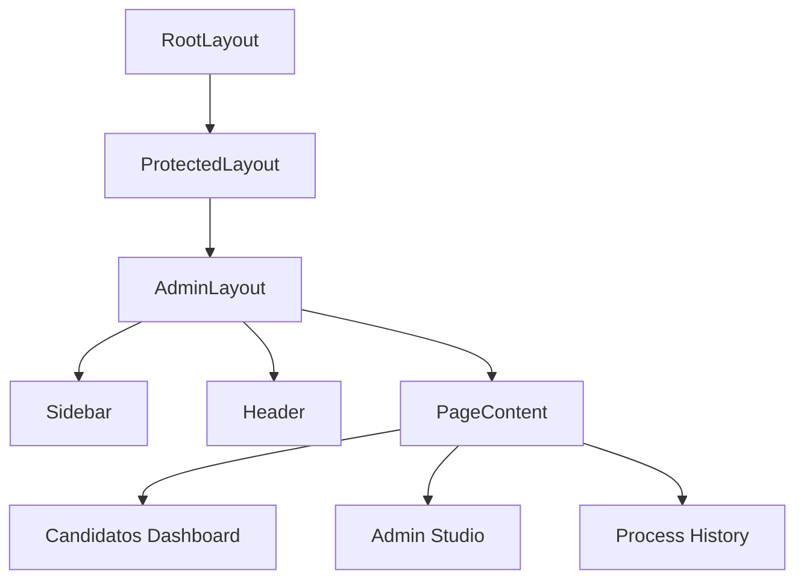

# Quickstart: Unified Admin Layer

## Context

This feature unifies the admin experience by moving all administrative views into a single, shared layout structure under `app/(protected)/admin`.

## Architecture

## How to use the new AdminLayout

When adding a new admin-only page:

1. Create a directory under `app/(protected)/admin/` (e.g., `app/(protected)/admin/reports/page.tsx`).
2. The page will automatically be wrapped by `AdminLayout`.
3. Add the new route to the `NAV_ITEMS` constant in `src/components/admin/AdminSidebar.tsx`.

## Key Files

- `src/components/admin/AdminLayout.tsx`: The main wrapper.
- `src/components/admin/AdminSidebar.tsx`: Navigation links.
- `app/(protected)/admin/layout.tsx`: Route-specific layout for the admin domain.
